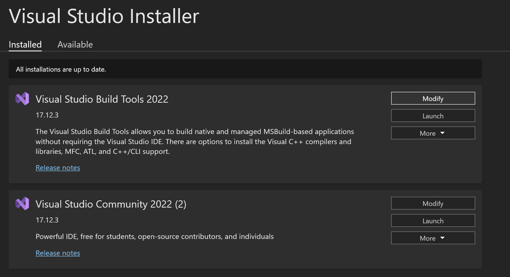

# cmake-visualstudio-quickstart
[https://github.com/hailiang-wang/cmake-visualstudio-quickstart](https://github.com/hailiang-wang/cmake-visualstudio-quickstart)


## Deps

* Windows11 OR Windows10
* Visual Studio 2022 Community
* Desktop Development with C++ Workload




## Configure

Set `Path`

```
CMAKE_HOME=C:\devel\Microsoft\VisualStudio\ide2022community\Common7\IDE\CommonExtensions\Microsoft\CMake\CMake
Path=%CMAKE_HOME%\bin ...
```


## Build with CLI

```
git clone git@github.com:hailiang-wang/cmake-visualstudio-quickstart.git
cd cmake-visualstudio-quickstart
mkdir out
cd out
cmake ..
cmake build
```