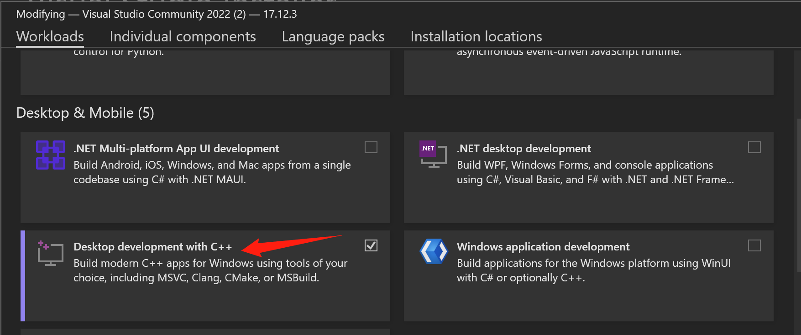

# cmake-visualstudio-quickstart
[https://github.com/hailiang-wang/cmake-visualstudio-quickstart](https://github.com/hailiang-wang/cmake-visualstudio-quickstart)


## Deps

* Windows11 OR Windows10
* Visual Studio 2022 Community
* Desktop Development with C++ Workload




## Configure

Set `Path`

```
CMAKE_HOME=C:\devel\Microsoft\VisualStudio\ide2022community\Common7\IDE\CommonExtensions\Microsoft\CMake\CMake
Path=%CMAKE_HOME%\bin ...
```


## Build with CLI

```
git clone git@github.com:hailiang-wang/cmake-visualstudio-quickstart.git
cd cmake-visualstudio-quickstart
mkdir out
cd out
cmake ..
cmake build
```

Now, you get 


OR, run scripts

```
bin/build.sh
bin/run.sh
```

## Links

* [CMake projects in Visual Studio](https://learn.microsoft.com/en-us/cpp/build/cmake-projects-in-visual-studio?view=msvc-170)
* [CMake Step 1: A Basic Starting Point](https://cmake.org/cmake/help/latest/guide/tutorial/A%20Basic%20Starting%20Point.html#)
* [cmake-presets](https://cmake.org/cmake/help/latest/manual/cmake-presets.7.html)
* [vcpkg Browse packages](https://vcpkg.io/en/packages?query=)